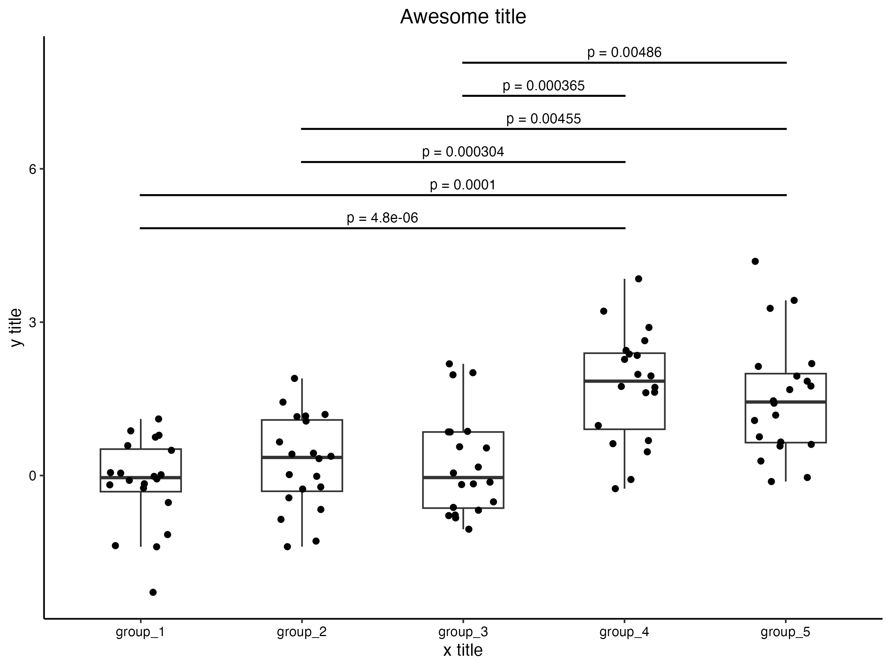
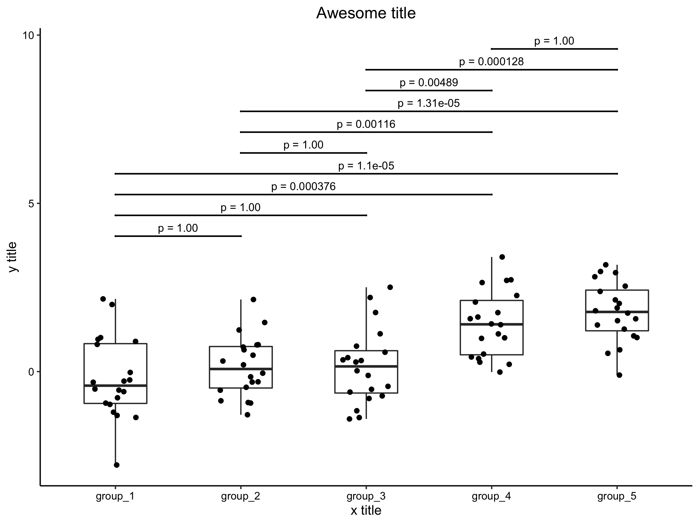

# R-ggplot-ttest

`ggplot`パッケージの`geom_jitter()`と多重t検定の結果を同時にプロットする関数を提供します。

## 要件

以下のRパッケージを利用します。

- ggplot2
- ggprism
- dplyr

## 関数

```R
plot_jitter_ttest(data, col_values, col_name, label_name,
                 category, levels_manual = NULL,
                 subset_categories = NULL, subset_items = NULL,
                 log_bool = TRUE,
                 ttest_bool = TRUE,
                 ttest_alternative = "two.sided",
                 ttest_adjust_method = "bonferroni",
                 ttest_remove_bool = TRUE,
                 ttest_sig = 0.05,
                 ttest_y_scale = 0.1,
                 plot_title = "Awesome title",
                 x_title = "x title", y_title = "y title", ...)
```

### 引数

`data`（必須）：

`data.frame`型のデータ

引数となるデータは、列に

- 値（y軸）
- 値の名前
- グループ（x軸）

を含むことが想定されています。

`col_values`（必須）：

y軸にプロットされる値が格納された列の列名を指定します。

`col_name`（必須）：

y軸にプロットされる値の名前が格納された列の列名を指定します。

`label_name`（必須）：

利用する値の名前を指定します。`col_name`で指定される列に含まれる必要があります。

`category`（必須）：

x軸に利用されるグループが格納された列の列名を指定します。

`levels_manual`：

x軸のグループの順番を指定する場合に文字列のベクトルを指定します。過不足ないことが想定されます。

`subset_categories`：

`data`で渡されるデータの一部を利用する場合に、基準となる列の列名を指定します。ベクトルでもokです。

`subset_items`：

`subset_categories`に対応して、利用する値を指定します。`subset_categories`と同じ長さのベクトルである必要があります。

`log_bool`：

y軸にプロットされる値に対して対数変換するかどうかのbool値です（`TRUE` or `FALSE`）。

`ttest_bool`：

t検定を行うかどうかを指定するbool値です（`TRUE` or `FALSE`）。t検定のプロットをするかどうかの指定も兼ねています。

`ttest_alternative`：

t検定の方法を指定します。詳しくは`t.test()`のドキュメントを参照してください。

`ttest_adjust_method`：

多重検定での補正の方法を指定します。詳しくは`p.adjust()`のドキュメントを参照してください。

`ttest_remove_bool`：

t検定の結果について、`ttest_sig`以上の値をプロットから除外するかどうかのbool値です（`TRUE` or `FALSE`）。

`ttest_sig`：

`ttest_remove_bool`が`TRUE`の場合に除外されるp値の基準です。

`ttest_y_scale`：

t検定の結果のプロットの縦軸方向のスケールの調整をします。

`outlier_bool`：

箱ひげ図のプロットで外れ値を含めるかどうかを指定します（`TRUE` or `FALSE`）。デフォルトは`FALSE`で、`geom_boxplot()`に渡される`coef`は`1.5`です。`TRUE`では`coef`に`Inf`が渡されます。詳細は`geom_boxplot()`のドキュメントを参照してください。

`plot_title`：

プロットのタイトルを指定します。

`x_title`：

x軸のタイトルを指定します。

`y_title`：

y軸のタイトルを指定します。


## 利用例

`example.R`に利用例をまとめたコードがあります。

データ

```R
library(tidyr)

data_test <- data.frame(
    id = paste0("patient_", 1:100),
    y_norm = c(rnorm(20*3, mean = 0, sd = 1), rnorm(20*2, mean = 3, sd = 1)),
    y_lnorm = c(rlnorm(20*3, meanlog = 0, sdlog = 1), rlnorm(20*2, meanlog = 1.5, sdlog = 1)),
    group = rep(paste0("group_", 1:5), each = 20),
    subcategory = sample(LETTERS[1:2], 100, replace = TRUE)
  )

data_plot <- pivot_longer(data = data_test, cols = -c(id, group, subcategory))
```

関数の読み込み

```R
source("function.R")
```

デフォルトのプロット

```R
## default plot
plt <- plot_jitter_ttest(data = data_plot, col_values = "value", col_name = "name", label_name = "y_lnorm",
                         category = "group")$plot

ggsave(plt, filename = "outputs/00_default_plot.png", w = 8, h = 6)
```



全てのp値をプロット

```R
## plot all p-values
plt <- plot_jitter_ttest(data = data_plot,
                         col_values = "value", col_name = "name", label_name = "y_lnorm",
                         category = "group",
                         ttest_remove_bool = FALSE)$plot

ggsave(plt, filename = "outputs/01_plot_all_pvalues.png", w = 8, h = 6)
```



プロットのタイトルと軸のタイトルを変更

```R
## change plot title and axis titles
plt <- plot_jitter_ttest(data = data_plot, col_values = "value", col_name = "name", label_name = "y_lnorm",
                         category = "group",
                         plot_title = "Another title", x_title = "Group", y_title = "Value")$plot

ggsave(plt, filename = "outputs/02_plot_title_axis_title.png", w = 8, h = 6)
```


x軸の順番の変更

```R
## change order of categories (x axis)
plt <- plot_jitter_ttest(data = data_plot, col_values = "value", col_name = "name", label_name = "y_lnorm",
                         category = "group",
                         levels_manual = c("group_3", "group_2", "group_4", "group_5", "group_1"))$plot

ggsave(plt, filename = "outputs/03_order_categories.png", w = 8, h = 6)
```


t検定の結果を表示しない

```R
## hide t-test
plt <- plot_jitter_ttest(data = data_plot, col_values = "value", col_name = "name", label_name = "y_lnorm",
                         category = "group",
                         ttest_bool = FALSE)$plot

ggsave(plt, filename = "outputs/04_hide_ttest.png", w = 8, h = 6)
```


一部のデータを利用

```R
## use subgroup
plt <- plot_jitter_ttest(data = data_plot, col_values = "value", col_name = "name", label_name = "y_lnorm",
                         category = "group",
                         subset_categories = "subcategory", subset_items = "B")$plot

ggsave(plt, filename = "outputs/05_use_subgroup.png", w = 8, h = 6)
```


`ggplot`を利用した修正

```R
## change plot options with ggplot
plt <- plot_jitter_ttest(data = data_plot, col_values = "value", col_name = "name", label_name = "y_lnorm",
                         category = "group")$plot

plt <- plt +
  xlab("Updated x title") +
  theme(axis.title = element_text(color = "red"))

ggsave(plt, filename = "outputs/06_plot_options.png", w = 8, h = 6)
```


t検定の結果を出力

```R
## get t-test result
result <- plot_jitter_ttest(data = data_plot, col_values = "value", col_name = "name", label_name = "y_lnorm",
                            category = "group")$ttest

print(result)
```

```R
    group1  group2        label
1  group_1 group_2 1.000000e+00
2  group_1 group_3 1.000000e+00
3  group_1 group_4 3.761758e-04
4  group_1 group_5 1.098997e-05
5  group_2 group_3 1.000000e+00
6  group_2 group_4 1.157610e-03
7  group_2 group_5 1.307043e-05
8  group_3 group_4 4.892677e-03
9  group_3 group_5 1.281609e-04
10 group_4 group_5 1.000000e+00
```

